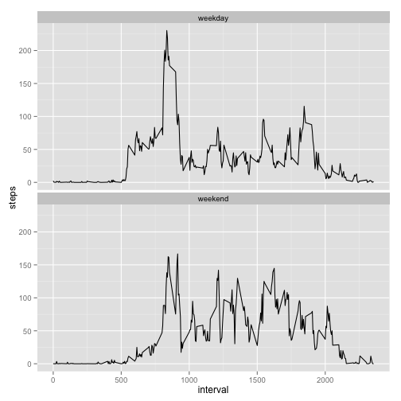

## Loading and preprocessing the data

```r
library(ggplot2)

activity = read.csv("activity.csv", stringsAsFactors=FALSE)
activity[, "date"] = as.Date(activity[, "date"], "%Y-%m-%d")  # convert to date format
```


## What is mean total number of steps taken per day?

```r
# ignore NA values
# note that this will cause some dates to be missing
activity_by_day = aggregate(steps ~ date, activity[!is.na(activity["steps"]), ], sum)
hist(activity_by_day$steps, main = "Total Steps Per Day", xlab = "Total Steps Per Day", freq = TRUE, breaks = 10)
```

 

The mean total number of steps taken per day is calculated below:

```r
mean(activity_by_day$steps)
```

```
## [1] 10766.19
```

The median total number of steps taken per day is calculated below:

```r
median(activity_by_day$steps)
```

```
## [1] 10765
```


## What is the average daily activity pattern?

```r
# ignore NA values
activity_by_interval = aggregate(steps ~ interval, activity[!is.na(activity["steps"]), ], mean)
plot(activity_by_interval$interval, activity_by_interval$steps, xlab = "Interval", ylab = "Average Steps",
     main = "Average Steps Per Interval", type = 'l')
```

 

The interval with the maximum number of average steps is calculated below:

```r
activity_by_interval[activity_by_interval$steps == max(activity_by_interval$steps), ]$interval
```

```
## [1] 835
```


## Imputing missing values

The total number of missing values is shown below:

```r
sum(is.na(activity$steps))
```

```
## [1] 2304
```

To impute missing values, the average value for the missing interval will be used.  It seems like this would result in more likely data.  For example, in the
middle of the night, when there's little activity, it's better to use a tiny value than the average for that day, which would be higher and not typical for
the middle of the night.


```r
# put the NA rows into a new data frame
activity_na = activity[is.na(activity$steps), c("date", "interval")]

# merge NA rows with interval averages
# sort columns to be in the same order as original data frame
activity_na_imputed = merge(activity_by_interval, activity_na)[, c('steps','date','interval')]

# combine merged data with non-NA rows
activity_imputed = rbind(activity_na_imputed, activity[!is.na(activity$steps), ])

# plot histogram
activity_imputed_by_day = aggregate(steps ~ date, activity_imputed, sum)
hist(activity_imputed_by_day$steps, main = "Total Steps Per Day After Imputing", xlab = "Total Steps Per Day", freq = TRUE, breaks = 10)
```

 

The mean total number of steps taken per day after imputing is calculated below.  

```r
mean(activity_imputed_by_day$steps)
```

```
## [1] 10766.19
```

The median total number of steps taken per day after imputing is calculated below:

```r
median(activity_imputed_by_day$steps)
```

```
## [1] 10766.19
```

After imputing, the mean is the same as before.  The reason for this is all missing values came from days where every interval had a missing value.  The result would be different if there were days where some, but not all, values are missing.  Similarly, the median is almost the same and is slightly higher.  The impact of imputing
missing data was to add more days which all had the average number of steps.  This causes the data after imputing to have more concentration around the mean.


## Are there differences in activity patterns between weekdays and weekends?


```r
activity_imputed$day_type = is.element(weekdays(activity_imputed$date), c('Saturday', 'Sunday'))
activity_imputed$day_type[activity_imputed$day_type == "TRUE"] = "weekend"
activity_imputed$day_type[activity_imputed$day_type == "FALSE"] = "weekday"
activity_imputed$day_type = factor(activity_imputed$day_type)
activity_imputed_by_interval_day = aggregate(steps ~ interval + day_type, activity_imputed, mean)
ggplot(activity_imputed_by_interval_day, aes(interval, steps)) + geom_line() + facet_wrap(~day_type, ncol=1)
```

 
